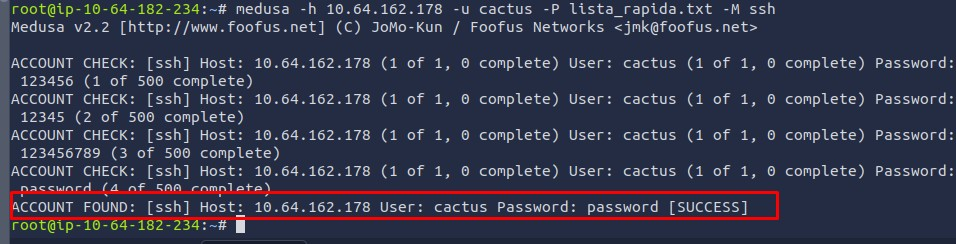

# Relatório Técnico: Minha Auditoria de Segurança com Medusa

## 1. Resumo do Projeto
Realizei este projeto prático como parte do Bootcamp de Cibersegurança da Riachuelo (DIO), utilizando o ambiente do TryHackMe ("Network Services"). Meu objetivo foi explorar vulnerabilidades de autenticação utilizando a ferramenta **Medusa**. O que começou como uma tarefa simples evoluiu para um exercício de troubleshooting, onde precisei adaptar minha estratégia, saindo de uma falha no FTP para uma invasão bem-sucedida via SSH.

## 2. Minha Cronologia de Execução

### Fase 1: A Falha Inicial (Tentativa FTP)
Seguindo o escopo original do desafio, minha primeira abordagem foi tentar um ataque de força bruta contra o serviço FTP (Porta 21). Executei o comando padrão do Medusa apontando para o alvo.

**Meu Comando:**
`medusa -h 10.64.162.178 -u msfadmin -P /usr/share/wordlists/rockyou.txt -M ftp`

**Resultado:** O ataque falhou imediatamente. Recebi erros de conexão (`Connection refused`), o que me indicou que a porta 21 não estava acessível naquele servidor.

### Fase 2: Reconhecimento e Mudança de Estratégia
Não me dei por vencido com a falha do FTP. Decidi investigar o ambiente para entender o que realmente estava rodando. Executei um scan completo de portas com o **Nmap**.

**Meu Comando:**
`nmap -sV 10.64.162.178`

**O que descobri:** O scan me mostrou que apenas as portas **22 (SSH)** e **445 (SMB)** estavam abertas. Com essa informação em mãos, redirecionei meu foco para atacar o SSH.

### Fase 3: Enumeração de Usuários
Eu sabia que atacar o usuário `root` seria perda de tempo (devido a bloqueios padrão). Então, explorei a porta 445 (SMB) usando ferramentas de enumeração para descobrir usuários válidos no sistema.

**Evidência da Enumeração:**
Foi assim que identifiquei o usuário alvo: **`cactus`**.

### Fase 4: Otimização de Performance (Troubleshooting)
Ao tentar rodar o Medusa contra o usuário `cactus` usando a wordlist completa `rockyou.txt` (14 milhões de senhas), percebi que o processo seria inviável devido à demora do *handshake* do SSH.

Minha solução foi criar uma wordlist personalizada e otimizada (`lista_rapida.txt`), filtrando apenas as 500 senhas mais comuns da lista original.

**Comando de Otimização:**
`head -n 500 /usr/share/wordlists/rockyou.txt > lista_rapida.txt`

### Fase 5: Exploração Bem-Sucedida
Com o usuário correto e minha wordlist otimizada, executei o ataque final.

**Meu Comando Final:**
`medusa -h 10.64.162.178 -u cactus -P lista_rapida.txt -M ssh`

**Minha Evidência:**
Consegui quebrar a senha em menos de 1 minuto.
* **Alvo:** 10.64.162.178
* **Usuário:** `cactus`
* **Senha:** `password`
* **Status:** `[SUCCESS]`

## 3. Minhas Recomendações de Segurança (Hardening)
Com base na facilidade que tive para invadir este servidor, recomendo as seguintes correções imediatas:

1.  **Políticas de Senha:** A senha que encontrei ("password") é inaceitável. É necessário bloquear o uso de palavras de dicionário.
2.  **Mitigação de Brute Force:** A implementação do **Fail2Ban** teria bloqueado meu IP após as primeiras tentativas falhas.
3.  **Desativação de Login por Senha:** Configurar o SSH para aceitar apenas chaves públicas (`PubkeyAuthentication yes`) e proibir senhas (`PasswordAuthentication no`).

## 4. Conclusão
Este projeto me mostrou que saber usar a ferramenta (Medusa) é apenas o começo. O verdadeiro aprendizado foi entender o ambiente, contornar os erros (porta fechada, lentidão) e persistir até conseguir o acesso. A combinação de reconhecimento (Nmap) com ataque direcionado foi a chave do meu sucesso.

---
*Autor: Higor Samuel Rodrigues | Bootcamp Cibersegurança Riachuelo*
